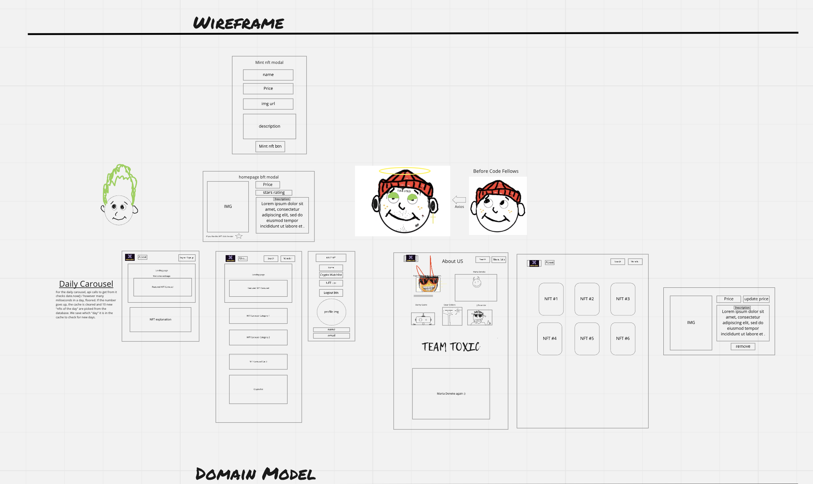
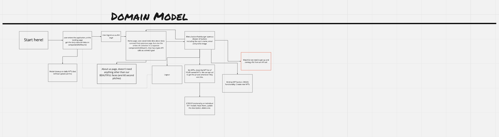
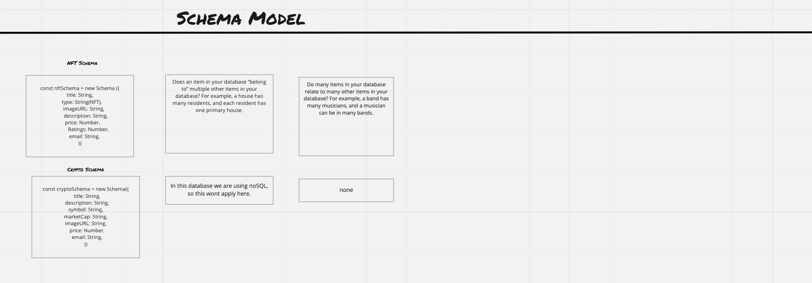

# Wireframe

# Domain Model

# Schema

# Trello Board and User Stories

[Trello Board tasks and user stories](https://trello.com/b/Syls0P72/project-m3rcado)

# Software Requirements

1. What is the vision of this product?
    - NFT Marketplace

1. What pain point does this project solve?
    - It leverages blockchain technology to make a decentralized application

1. Why should we care about your product?
    - It is a forward thinking W3 application that leverages blockchain technology

    ## Scope (In)
    1. It will create NFT's for users
    1. It will it will display NFTS from the database
    1. It will allow users to delete and update their respective nfts
    1. It will allow users to see cryptos
    1. it will allows users to rate other NFTs in the website

    ## Scope (Out)
    1. It will not ask for payments
    1. It will not collect data on crypto wallets
    1. It will not store user information
    1. It will not implement its own Authentication
    1. It will not store financial transactions

    ## Minimum Viable Product

    1. Simulate NFT assets
    1. Perform Crud on NFT assets
    1. Display cryptos

    ## Streatch Goals

    1. Implement Minting NFT in the blockchain network
    1. Refactor codebase to typescript
    1. Implement watchlist

    ## Flow
     - The frontend makes an api get request from coingecko to get the Cryptos
     - The frontend makes an api  get request from the backend server to get Crypto
     - The frontend makes an api post request to mint NFT
     - The frontend makes an api delete request to delete NFT from the database
     - the frontend makes a put request to update NFT price

# Non functional requirements
  1. Security - the app will implement Oauth authentication paradigm
  1. Scalability - the app will be deployed to free tier of Heroku and Netlify which have limited allowable api request per day.

